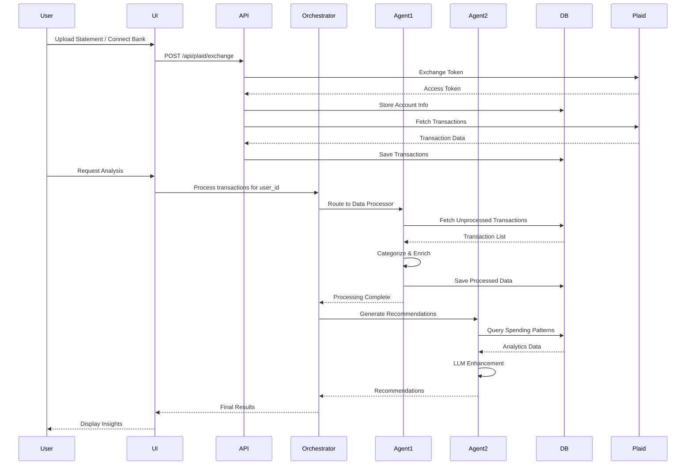

# Smart Expense Analyzer - Technical Documentation

**Version:** 1.0.0  
**Date:** December 2024  
**Authors:** Team RSS

---

## Table of Contents

1. [Executive Summary](#executive-summary)
2. [System Architecture](#system-architecture)
3. [Technology Stack](#technology-stack)
4. [Database Design](#database-design)
5. [Multi-Agent System](#multi-agent-system)
6. [API Specifications](#api-specifications)
7. [Data Flow & Processing](#data-flow--processing)
8. [Integration Patterns](#integration-patterns)
9. [Security & Authentication](#security--authentication)
10. [Deployment Architecture](#deployment-architecture)
11. [Code Examples](#code-examples)
12. [Performance Considerations](#performance-considerations)

---

## Executive Summary

The Smart Expense Analyzer is a cloud-native, multi-agent financial intelligence system that processes bank transactions, detects spending patterns, and provides AI-powered financial recommendations. The system leverages Google's Agent Development Kit (ADK), Gemini AI models, and integrates with Plaid for real-time transaction data.

### Key Technical Highlights

- **Multi-Agent Architecture**: Three specialized AI agents working in coordination
- **Cloud-Native**: Built for Google Cloud Platform with Cloud SQL PostgreSQL
- **Real-Time Processing**: Asynchronous transaction processing with deduplication
- **AI-Powered Analysis**: LLM-enhanced categorization, fraud detection, and recommendations
- **Scalable Design**: Microservices architecture with Docker containerization

---

## System Architecture

### High-Level Architecture Diagram

```
┌─────────────────────────────────────────────────────────────────┐
│                        User Interface Layer                      │
│  ┌──────────────────┐  ┌──────────────────┐                  │
│  │  Streamlit UI    │  │  FastAPI REST    │                  │
│  │  (Port 8501)     │  │  (Port 8000)     │                  │
│  └────────┬─────────┘  └────────┬─────────┘                  │
└───────────┼──────────────────────┼────────────────────────────┘
            │                      │
            │                      │
┌───────────▼──────────────────────▼────────────────────────────┐
│                    Application Layer                          │
│  ┌──────────────────────────────────────────────────────┐   │
│  │         Multi-Agent Orchestration System              │   │
│  │  ┌──────────────┐  ┌──────────────┐  ┌─────────────┐ │   │
│  │  │ Agent 1:     │  │ Agent 2:     │  │ Query      │ │   │
│  │  │ Data         │  │ Financial    │  │ Agent      │ │   │
│  │  │ Processor    │  │ Analyst      │  │            │ │   │
│  │  └──────┬───────┘  └──────┬──────┘  └──────┬──────┘ │   │
│  │         │                  │                 │        │   │
│  │         └──────────────────┴─────────────────┘        │   │
│  │                    Root Orchestrator                  │   │
│  └───────────────────────────┬───────────────────────────┘   │
└───────────────────────────────┼───────────────────────────────┘
                                │
┌───────────────────────────────▼───────────────────────────────┐
│                    Service Layer                               │
│  ┌──────────────┐  ┌──────────────┐  ┌──────────────┐        │
│  │ Plaid        │  │ Statement    │  │ Transaction  │        │
│  │ Service      │  │ Parser       │  │ Deduplicator │        │
│  └──────┬───────┘  └──────┬──────┘  └──────┬───────┘        │
└─────────┼──────────────────┼─────────────────┼───────────────┘
          │                  │                 │
          │                  │                 │
┌─────────▼──────────────────▼─────────────────▼───────────────┐
│                    Data Layer                                 │
│  ┌──────────────────────────────────────────────────────┐   │
│  │         Cloud SQL PostgreSQL                         │   │
│  │  ┌──────────┐  ┌──────────┐  ┌──────────┐            │   │
│  │  │ Users    │  │ Accounts │  │Transactions│          │   │
│  │  │          │  │          │  │          │            │   │
│  │  │ Processed│  │Subscriptions│ │Patterns│            │   │
│  │  │Transactions│ │          │  │          │            │   │
│  │  └──────────┘  └──────────┘  └──────────┘            │   │
│  └──────────────────────────────────────────────────────┘   │
└──────────────────────────────────────────────────────────────┘
```

### Component Interaction Flow



---

## Technology Stack

### Core Technologies

| Component | Technology | Version | Purpose |
|-----------|-----------|---------|---------|
| **Backend Framework** | FastAPI | 0.115.0 | REST API server |
| **Frontend** | Streamlit | 1.38.0 | Web UI dashboard |
| **AI Framework** | Google ADK | Latest | Agent orchestration |
| **LLM** | Google Gemini | 2.5 Flash | AI reasoning |
| **Database** | PostgreSQL | 16+ | Data persistence |
| **ORM** | SQLAlchemy | 2.0+ | Database abstraction |
| **Cloud Database** | Google Cloud SQL | - | Managed PostgreSQL |
| **Integration** | Plaid API | 20.0+ | Bank data |
| **PDF Processing** | pdfplumber | 0.10+ | Statement parsing |
| **Containerization** | Docker | Latest | Deployment |

### Python Dependencies

```python
# requirements.txt (Key Dependencies)
fastapi==0.115.0
uvicorn[standard]==0.30.3
plaid-python>=20.0.0
streamlit==1.38.0
google-generativeai>=0.3.0
sqlalchemy>=2.0.0
psycopg2-binary>=2.9.9
cloud-sql-python-connector[pg8000]>=1.11.0
pg8000>=1.31.0
toolbox-core>=0.1.0
pdfplumber>=0.10.0
pydantic>=2.0.0
```

---

## Database Design

### Entity Relationship Diagram

```
┌─────────────┐         ┌─────────────┐         ┌──────────────┐
│    Users    │         │   Accounts  │         │ Transactions │
├─────────────┤         ├─────────────┤         ├──────────────┤
│ id (PK)     │◄──┐     │ id (PK)     │◄──┐     │ id (PK)      │
│ username    │   │     │ user_id (FK)│   │     │ transaction_ │
│ email       │   │     │ account_id  │   │     │   id (UK)    │
│ password_   │   │     │ name        │   │     │ account_id   │
│   hash      │   │     │ type        │   │     │   (FK)       │
│ created_at  │   │     │ balance     │   │     │ user_id (FK) │
│ updated_at  │   │     │ access_     │   │     │ amount       │
└─────────────┘   │     │   token     │   │     │ date         │
                  │     │ institution │   │     │ merchant_    │
                  │     └─────────────┘   │     │   name       │
                  │                       │     │ category     │
                  │                       │     └──────────────┘
                  │                       │            │
                  │                       │            │
┌─────────────────┴───────────────────────┴────────────┴──────────┐
│                    Processed Transactions                       │
├─────────────────────────────────────────────────────────────────┤
│ id (PK)                                                         │
│ transaction_id (FK)                                            │
│ user_id (FK)                                                    │
│ category_ai                                                     │
│ merchant_standardized                                           │
│ is_subscription                                                 │
│ is_anomaly                                                      │
│ is_bill                                                         │
│ tags                                                            │
│ notes                                                           │
└─────────────────────────────────────────────────────────────────┘
```

### Core Tables Schema

#### Users Table

```sql
CREATE TABLE users (
    id UUID PRIMARY KEY DEFAULT gen_random_uuid(),
    username VARCHAR(50) UNIQUE NOT NULL,
    email VARCHAR(255) UNIQUE NOT NULL,
    password_hash VARCHAR(255) NOT NULL,
    monthly_income DECIMAL(12,2),
    life_stage VARCHAR(50),
    dependents INTEGER,
    location VARCHAR(255),
    budget_alert_threshold DECIMAL(5,2) DEFAULT 1.30,
    profile_completed BOOLEAN DEFAULT FALSE,
    created_at TIMESTAMP DEFAULT CURRENT_TIMESTAMP,
    updated_at TIMESTAMP DEFAULT CURRENT_TIMESTAMP
);

CREATE INDEX idx_users_username ON users(username);
CREATE INDEX idx_users_email ON users(email);
```

#### Accounts Table

```sql
CREATE TABLE accounts (
    id UUID PRIMARY KEY DEFAULT gen_random_uuid(),
    user_id UUID NOT NULL REFERENCES users(id) ON DELETE CASCADE,
    account_id VARCHAR(255) NOT NULL,  -- Plaid account ID
    name VARCHAR(255),
    type VARCHAR(50),
    subtype VARCHAR(50),
    mask VARCHAR(10),
    current_balance DECIMAL(12,2),
    available_balance DECIMAL(12,2),
    limit DECIMAL(12,2),
    currency VARCHAR(3) DEFAULT 'USD',
    access_token TEXT,
    item_id VARCHAR(255),
    institution_name VARCHAR(255),
    institution_id VARCHAR(255),
    source VARCHAR(50) DEFAULT 'plaid',
    created_at TIMESTAMP DEFAULT CURRENT_TIMESTAMP,
    last_synced TIMESTAMP,
    UNIQUE(user_id, account_id)
);

CREATE INDEX idx_accounts_user_id ON accounts(user_id);
CREATE INDEX idx_accounts_account_id ON accounts(account_id);
```

#### Transactions Table

```sql
CREATE TABLE transactions (
    id UUID PRIMARY KEY DEFAULT gen_random_uuid(),
    transaction_id VARCHAR(255) UNIQUE NOT NULL,
    account_id UUID NOT NULL REFERENCES accounts(id) ON DELETE CASCADE,
    user_id UUID NOT NULL REFERENCES users(id) ON DELETE CASCADE,
    amount DECIMAL(12,2) NOT NULL,
    date DATE NOT NULL,
    authorized_date DATE,
    name VARCHAR(500),
    merchant_name VARCHAR(255),
    merchant_entity_id VARCHAR(255),
    category TEXT[],
    category_id VARCHAR(50),
    personal_finance_category JSONB,
    location JSONB,
    payment_channel VARCHAR(50),
    pending BOOLEAN DEFAULT FALSE,
    transaction_type VARCHAR(50),
    source VARCHAR(50) DEFAULT 'plaid',
    saved_at TIMESTAMP DEFAULT CURRENT_TIMESTAMP,
    CHECK (amount != 0)
);

CREATE INDEX idx_transactions_user_id ON transactions(user_id);
CREATE INDEX idx_transactions_account_id ON transactions(account_id);
CREATE INDEX idx_transactions_date ON transactions(date DESC);
CREATE INDEX idx_transactions_transaction_id ON transactions(transaction_id);
```

#### Processed Transactions Table

```sql
CREATE TABLE processed_transactions (
    id UUID PRIMARY KEY DEFAULT gen_random_uuid(),
    transaction_id VARCHAR(255) UNIQUE NOT NULL REFERENCES transactions(transaction_id),
    user_id UUID NOT NULL REFERENCES users(id) ON DELETE CASCADE,
    category_ai VARCHAR(100),
    merchant_standardized VARCHAR(255),
    is_subscription BOOLEAN DEFAULT FALSE,
    subscription_confidence DECIMAL(3,2),
    is_anomaly BOOLEAN DEFAULT FALSE,
    anomaly_score DECIMAL(3,2),
    anomaly_reason TEXT,
    is_bill BOOLEAN DEFAULT FALSE,
    bill_cycle_day INTEGER,
    tags JSONB,
    notes TEXT,
    processed_at TIMESTAMP DEFAULT CURRENT_TIMESTAMP
);

CREATE INDEX idx_processed_user_id ON processed_transactions(user_id);
CREATE INDEX idx_processed_transaction_id ON processed_transactions(transaction_id);
CREATE INDEX idx_processed_category ON processed_transactions(category_ai);
```

### Database Connection Implementation

```python
# src/core/database.py (Excerpt)

from sqlalchemy import create_engine
from sqlalchemy.orm import sessionmaker, declarative_base
from cloud_sql_connector import Connector
import pg8000

class PostgreSQLDatabase:
    """PostgreSQL database implementation using SQLAlchemy"""
    
    def __init__(self):
        """Initialize database connection"""
        if Config.USE_CLOUD_SQL:
            # Cloud SQL connection using connector
            connector = Connector()
            
            def getconn():
                conn = connector.connect(
                    Config.CLOUD_SQL_CONNECTION_NAME,
                    "pg8000",
                    user=Config.DB_USER,
                    password=Config.DB_PASSWORD,
                    db=Config.DB_NAME
                )
                return conn
            
            self.engine = create_engine(
                "postgresql+pg8000://",
                creator=getconn,
                pool_pre_ping=True,
                pool_size=5,
                max_overflow=10
            )
        else:
            # Local PostgreSQL connection
            self.engine = create_engine(
                Config.DB_CONNECTION_STRING,
                pool_pre_ping=True
            )
        
        self.SessionLocal = sessionmaker(
            bind=self.engine,
            autocommit=False,
            autoflush=False
        )
    
    def _get_session(self) -> Session:
        """Get database session"""
        return self.SessionLocal()
```

---

## Multi-Agent System

### Agent Architecture

The system employs a multi-agent architecture where specialized agents handle different aspects of financial analysis:

#### Agent 1: Data Processor

**Purpose**: Process and enrich raw transaction data

**Implementation**:

```python
# agents/agent1_data_processor.py

from google.adk.agents import LlmAgent
from google.adk.tools import FunctionTool
from google.adk.runners import InMemoryRunner

# Define the agent
agent1_data_processor = LlmAgent(
    name="agent1_data_processor",
    model="gemini-flash-lite-latest",
    description="Agent 1: Data Processor for financial transactions",
    tools=[
        FunctionTool(fetch_transactions),
        FunctionTool(categorize_transaction),
        FunctionTool(detect_fraud),
        FunctionTool(detect_subscriptions),
        FunctionTool(store_processed_data),
    ]
)

def process_user_transactions_agent1(user_id: str, limit: int = 50):
    """Process transactions for a user"""
    prompt_text = f"""Process all unprocessed transactions for user: {user_id}

Workflow:
1. Fetch new transactions (limit: {limit})
2. For each transaction:
    a. Categorize it
    b. Check for fraud
3. Detect subscription patterns
4. Mark all as processed
5. Provide summary

Execute now."""
    
    user_message = Content(
        parts=[Part(text=prompt_text)],
        role="user"
    )
    
    # Create session and run agent
    unique_session_id = str(uuid.uuid4())
    session_object = asyncio.run(
        agent_runner.session_service.create_session(
            app_name=APP_NAME,
            user_id=user_id,
            session_id=unique_session_id
        )
    )
    
    events = agent_runner.run(
        user_id=user_id,
        session_id=session_object.id,
        user_message=user_message
    )
    
    # Extract final response
    for event in events:
        if hasattr(event, 'content') and event.content:
            return event.content.text
    
    return "Processing completed"
```

**Tools Available to Agent 1**:

1. **fetch_transactions**: Retrieves unprocessed transactions
2. **categorize_transaction**: AI-powered categorization
3. **detect_fraud**: Anomaly detection
4. **detect_subscriptions**: Pattern recognition for recurring charges
5. **store_processed_data**: Persists enriched data

#### Agent 2: Financial Analyst

**Purpose**: Generate financial insights and recommendations

**Implementation**:

```python
# agents/agent2_financial_analyst.py

class FinancialAnalystLLMAgent:
    def __init__(self):
        self.tool_agent = FinancialAnalystAgent()
        self.llm_client = genai.Client()
    
    def generate_recommendations(self, user_id: str):
        """Generate recommendations with LLM-enhanced descriptions"""
        
        # Step 1: Get threshold-based recommendations
        result = self.tool_agent.generate_recommendations(user_id)
        
        if result.get('total_recommendations', 0) == 0:
            return result
        
        # Step 2: Enhance with LLM
        enhanced_recs = []
        for rec in result['recommendations']:
            enhanced = self._enhance_recommendation_with_llm(rec)
            enhanced_recs.append(enhanced)
        
        result['recommendations'] = enhanced_recs
        result['ai_overview'] = self._generate_overview_with_llm(result)
        
        return result
    
    def _enhance_recommendation_with_llm(self, rec: dict) -> dict:
        """Make recommendation personal and actionable with LLM"""
        prompt = f"""You are a friendly financial advisor. Rewrite this recommendation.

CURRENT:
Title: {rec['title']}
Description: {rec['description']}
Savings: ${rec['potential_savings']:.2f}/month

Create a better description (2-3 sentences) that:
1. Acknowledges the situation positively
2. Gives specific, practical advice
3. Motivates action"""
        
        response = self.llm_client.models.generate_content(
            model='gemini-2.5-flash',
            contents=prompt,
            config=types.GenerateContentConfig(
                temperature=0.7,
                max_output_tokens=150
            )
        )
        
        enhanced = rec.copy()
        enhanced['description'] = response.text.strip()
        enhanced['llm_generated'] = True
        
        return enhanced
```

**Capabilities**:

- Spending pattern analysis
- Budget recommendations
- Savings opportunity identification
- Daily/weekly/monthly summaries
- LLM-enhanced personalized advice

#### Root Orchestrator

**Purpose**: Route user requests to appropriate agents

**Implementation**:

```python
# agents/root_orchestrator.py

class RootOrchestratorAgent:
    def __init__(self):
        self.agent1 = DataProcessorLLMAgent()
        self.agent2 = FinancialAnalystLLMAgent()
        self.query_agent = QueryAgent()
    
    def route(self, user_input: str):
        """Route request to appropriate agent"""
        text = user_input.lower()
        user_id = self.extract_user_id(text)
        
        # Agent 1: Transaction Processing
        if any(k in text for k in ["process", "categorize"]) and "transaction" in text:
            return self.agent1.process_transactions(user_id)
        
        # Agent 2: Recommendations
        elif any(k in text for k in ["recommend", "savings", "optimize budget"]):
            return self.agent2.generate_recommendations(user_id)
        
        # Query Agent: Analytical questions
        elif any(k in text for k in ["which", "what", "how much", "show me"]):
            return self.query_agent.answer_question(user_id, user_input)
        
        else:
            return {'status': 'help', 'message': 'I can help with...'}
```

### Agent Communication Flow

```
User Request
    │
    ▼
Root Orchestrator (Intent Detection)
    │
    ├───► Agent 1 (Data Processing)
    │         │
    │         ├──► Fetch Transactions
    │         ├──► Categorize
    │         ├──► Detect Fraud
    │         └──► Store Results
    │
    ├───► Agent 2 (Financial Analysis)
    │         │
    │         ├──► Query Spending Patterns
    │         ├──► Calculate Metrics
    │         ├──► Generate Recommendations
    │         └──► LLM Enhancement
    │
    └───► Query Agent (Analytics)
              │
              ├──► Natural Language → SQL
              ├──► Execute Query
              └──► Format Response
```

---

## API Specifications

### FastAPI Endpoints

#### 1. Exchange Plaid Token

**Endpoint**: `POST /api/plaid/exchange`

**Request Body**:
```json
{
  "public_token": "public-sandbox-xxx"
}
```

**Response**:
```json
{
  "status": "success",
  "item_id": "item-xxx",
  "message": "Bank connected successfully"
}
```

**Implementation**:

```python
# src/app/main.py

@app.post("/api/plaid/exchange")
async def exchange_token(request: PlaidExchangeRequest):
    """Exchange public token for access token"""
    try:
        access_token, item_id = exchange_public_token(request.public_token)
        
        return {
            "status": "success",
            "item_id": item_id,
            "message": "Bank connected successfully"
        }
    except Exception as e:
        raise HTTPException(status_code=400, detail=str(e))
```

#### 2. Fetch Transactions

**Endpoint**: `GET /api/plaid/transactions`

**Query Parameters**:
- `access_token` (required): Plaid access token

**Response**:
```json
{
  "count": 150,
  "transactions": [
    {
      "transaction_id": "txn-xxx",
      "amount": -45.67,
      "date": "2024-12-01",
      "merchant_name": "AMAZON.COM",
      "category": ["Shops", "Supermarkets"]
    }
  ]
}
```

### MCP Toolbox Tools

The system exposes database operations through MCP Toolbox tools defined in `tools.yaml`:

#### fetch-unprocessed-transactions

**Description**: Get transactions that haven't been processed by AI

**Parameters**:
- `user_id` (string): User identifier

**SQL Implementation**:
```sql
SELECT 
    t.transaction_id,
    t.user_id,
    t.amount,
    t.date::text,
    t.name,
    t.merchant_name,
    t.category,
    t.personal_finance_category,
    t.payment_channel,
    t.transaction_type
FROM transactions t
LEFT JOIN processed_transactions pt ON t.transaction_id = pt.transaction_id
WHERE t.user_id = $1
    AND pt.id IS NULL
ORDER BY t.date DESC;
```

#### insert-processed-transaction

**Description**: Save AI-enhanced transaction data

**Parameters**:
- `transaction_id`, `user_id`, `category_ai`, `merchant_standardized`
- `is_subscription`, `subscription_confidence`
- `is_anomaly`, `anomaly_score`, `anomaly_reason`
- `is_bill`, `bill_cycle_day`
- `tags`, `notes`

**SQL Implementation**:
```sql
INSERT INTO processed_transactions (
    transaction_id, user_id, category_ai, merchant_standardized,
    is_subscription, subscription_confidence,
    is_anomaly, anomaly_score, anomaly_reason,
    is_bill, bill_cycle_day,
    tags, notes
) VALUES (
    $1, $2, $3, $4, $5, $6, $7, $8, $9, $10, $11, $12, $13
)
ON CONFLICT (transaction_id) DO UPDATE SET
    category_ai = EXCLUDED.category_ai,
    merchant_standardized = EXCLUDED.merchant_standardized,
    is_subscription = EXCLUDED.is_subscription,
    is_anomaly = EXCLUDED.is_anomaly,
    updated_at = CURRENT_TIMESTAMP;
```

---

## Data Flow & Processing

### Transaction Ingestion Flow

```python
# src/integrations/plaid_service.py (Excerpt)

class PlaidService:
    def sync_transactions(self, access_token: str, cursor: str = None):
        """Sync transactions from Plaid"""
        
        # Create sync request
        request = TransactionsSyncRequest(
            access_token=access_token,
            cursor=cursor
        )
        
        response = self.client.transactions_sync(request)
        data = response.to_dict()
        
        # Process transactions
        transactions = data.get('added', [])
        next_cursor = data.get('next_cursor')
        
        # Transform Plaid format to our schema
        transformed = []
        for txn in transactions:
            transformed.append({
                'transaction_id': txn['transaction_id'],
                'amount': txn['amount'],
                'date': txn['date'],
                'merchant_name': txn.get('merchant_name'),
                'category': txn.get('category'),
                'personal_finance_category': txn.get('personal_finance_category'),
                # ... more fields
            })
        
        return {
            'transactions': transformed,
            'next_cursor': next_cursor,
            'has_more': data.get('has_more', False)
        }
```

### Transaction Deduplication

```python
# src/services/transaction_deduplicator.py

class TransactionDeduplicator:
    def deduplicate_transactions(self, new_transactions, existing_transactions):
        """Remove duplicate transactions"""
        
        existing_set = {
            (t.get('transaction_id'), t.get('date'), abs(float(t.get('amount', 0))))
            for t in existing_transactions
        }
        
        unique_new = []
        duplicates = []
        
        for txn in new_transactions:
            key = (
                txn.get('transaction_id'),
                txn.get('date'),
                abs(float(txn.get('amount', 0)))
            )
            
            if key not in existing_set:
                unique_new.append(txn)
            else:
                duplicates.append(txn)
        
        return {
            'unique_new': unique_new,
            'duplicates': duplicates,
            'total_new': len(new_transactions),
            'unique_count': len(unique_new)
        }
```

### PDF Statement Processing

```python
# src/services/statement_parser.py (Excerpt)

class StatementParser:
    def parse(self, pdf_path: str) -> ParsedStatement:
        """Parse bank statement PDF"""
        
        # Step 1: Extract text from PDF
        text = self._extract_text_from_pdf(pdf_path)
        
        # Step 2: Sanitize PII
        sanitizer = PIISanitizer()
        sanitized_result = sanitizer.sanitize(text)
        
        # Step 3: Send to Gemini for structured extraction
        prompt = f"""Extract transaction data from this bank statement.
        
        {sanitized_result.sanitized_text}
        
        Return structured JSON with:
        - account_info
        - transactions (list)
        - statement_period
        """
        
        response = self.gemini_client.models.generate_content(
            model='gemini-2.5-flash',
            contents=prompt,
            config=types.GenerateContentConfig(
                response_mime_type='application/json'
            )
        )
        
        # Step 4: Parse and validate
        data = json.loads(response.text)
        parsed = ParsedStatement(**data)
        
        # Step 5: Restore PII
        parsed = self._restore_pii(parsed, sanitized_result.mapping)
        
        return parsed
```

---

## Integration Patterns

### Plaid Integration

```python
# src/integrations/plaid_service.py

from plaid.api import plaid_api
from plaid.configuration import Configuration, Environment

class PlaidService:
    def __init__(self):
        configuration = Configuration(
            host=Environment.Sandbox,  # or Environment.Production
            api_key={
                "clientId": Config.PLAID_CLIENT_ID,
                "secret": Config.PLAID_SECRET,
            }
        )
        api_client = ApiClient(configuration)
        self.client = plaid_api.PlaidApi(api_client)
    
    def create_link_token(self, user_id: str, user_email: str):
        """Create Plaid Link token for bank connection"""
        link_token_request = LinkTokenCreateRequest(
            products=[Products(p) for p in Config.PLAID_PRODUCTS],
            country_codes=[CountryCode(c) for c in Config.PLAID_COUNTRY_CODES],
            client_name=Config.APP_NAME,
            user=LinkTokenCreateRequestUser(
                client_user_id=user_id,
                email_address=user_email,
            ),
        )
        
        # Enable Hosted Link
        link_token_request['hosted_link'] = {}
        
        response = self.client.link_token_create(link_token_request)
        return response.to_dict()
```

### Cloud SQL Connection

```python
# src/models/database.py

from cloud_sql_connector import Connector
import pg8000

def init_db(use_cloud_sql: bool = False, connection_string: str = None):
    """Initialize database connection"""
    
    if use_cloud_sql:
        connector = Connector()
        
        def getconn():
            return connector.connect(
                Config.CLOUD_SQL_CONNECTION_NAME,  # project:region:instance
                "pg8000",
                user=Config.DB_USER,
                password=Config.DB_PASSWORD,
                db=Config.DB_NAME
            )
        
        engine = create_engine(
            "postgresql+pg8000://",
            creator=getconn,
            pool_pre_ping=True
        )
    else:
        engine = create_engine(connection_string)
    
    Base.metadata.create_all(bind=engine)
    return engine
```

### MCP Toolbox Integration

```python
# mcp_toolbox/agent.py

from toolbox_core import ToolboxSyncClient
from google.adk.agents import Agent

# Connect to toolbox service
client = ToolboxSyncClient("https://toolbox-service-xxx.us-central1.run.app/")

# Load tools
tools = client.load_toolset()

# Create agent with tools
root_agent = Agent(
    name='root_agent',
    model='gemini-2.5-flash',
    instruction="""Your responsibilities:
    1. Detect new unprocessed transactions
    2. Categorize transactions
    3. Detect subscriptions
    4. Identify fraud""",
    tools=tools,
    generate_content_config=types.GenerateContentConfig(
        temperature=0.3
    )
)
```

---

## Security & Authentication

### User Authentication

```python
# src/core/auth.py

import hashlib

def hash_password(password: str) -> str:
    """Hash password using SHA-256"""
    return hashlib.sha256(password.encode()).hexdigest()

def authenticate_user(username: str, password: str) -> Optional[Dict]:
    """Authenticate user"""
    db = get_database()
    user = db.get_user(username)
    
    if not user:
        return None
    
    hashed_password = hash_password(password)
    
    if user['password_hash'] == hashed_password:
        return user
    
    return None
```

### PII Sanitization

```python
# src/services/pii_sanitizer.py

import re
from typing import Dict, Tuple

class PIISanitizer:
    """Sanitize PII before sending to LLM"""
    
    def sanitize(self, text: str) -> SanitizationResult:
        """Replace PII with placeholders"""
        mapping = {}
        sanitized = text
        
        # Credit card numbers
        pattern = r'\b\d{4}[\s-]?\d{4}[\s-]?\d{4}[\s-]?\d{4}\b'
        matches = re.findall(pattern, sanitized)
        for i, match in enumerate(matches):
            placeholder = f"[CARD_{i}]"
            mapping[placeholder] = match
            sanitized = sanitized.replace(match, placeholder)
        
        # Account numbers
        pattern = r'\b\d{8,12}\b'
        # ... similar replacement
        
        return SanitizationResult(
            sanitized_text=sanitized,
            mapping=mapping
        )
```

### Environment Variables

```bash
# .env (Never commit this file)

# Plaid
PLAID_CLIENT_ID=your_client_id
PLAID_SECRET=your_secret
PLAID_ENV=sandbox

# Gemini
GEMINI_API_KEY=your_api_key

# Database
USE_CLOUD_SQL=true
CLOUD_SQL_CONNECTION_NAME=project:region:instance
DB_USER=postgres
DB_PASSWORD=secure_password
DB_NAME=smart_expense_db

# Service Account (for Cloud SQL)
GOOGLE_APPLICATION_CREDENTIALS=.secret/service-account.json
```

---

## Deployment Architecture

### Docker Configuration

```yaml
# docker/docker-compose.yaml

services:
  toolbox:
    image: us-central1-docker.pkg.dev/database-toolbox/toolbox/toolbox:latest
    platform: linux/amd64
    ports:
      - "5000:5000"
    volumes:
      - ./config:/config
      - ../mcp_toolbox/tools.yaml:/tools.yaml
      - ../.secret/service-account.json:/tmp/service-account.json:ro
    environment:
      - GOOGLE_APPLICATION_CREDENTIALS=/tmp/service-account.json
    command: ["toolbox", "--tools-file", "/tools.yaml", "--address", "0.0.0.0"]
    networks:
      - tool-network

networks:
  tool-network:
```

### Cloud Run Deployment

```bash
# Build and deploy
gcloud builds submit --tag gcr.io/PROJECT_ID/smart-expense-agent

gcloud run deploy smart-expense-agent \
  --image gcr.io/PROJECT_ID/smart-expense-agent \
  --platform managed \
  --region us-central1 \
  --set-env-vars "PLAID_CLIENT_ID=xxx,PLAID_SECRET=xxx" \
  --allow-unauthenticated \
  --memory 2Gi \
  --cpu 2
```

---

## Code Examples

### Complete Agent Workflow

```python
# Example: Processing transactions end-to-end

from agents.agent1_data_processor import process_user_transactions_agent1
from agents.agent2_financial_analyst import FinancialAnalystLLMAgent

# Step 1: Process transactions
user_id = "fd47f678-0c8a-42b5-8af2-936ec0e370c5"
result = process_user_transactions_agent1(user_id, limit=50)

print(f"Processed {result['processed_count']} transactions")
print(f"Found {result['subscriptions_detected']} subscriptions")
print(f"Flagged {result['anomalies_detected']} anomalies")

# Step 2: Get recommendations
analyst = FinancialAnalystLLMAgent()
recommendations = analyst.generate_recommendations(user_id)

for rec in recommendations['recommendations']:
    print(f"\n{rec['title']}")
    print(f"Potential Savings: ${rec['potential_savings']:.2f}/month")
    print(f"Description: {rec['description']}")
```

### Database Operations

```python
# Example: Saving transactions with deduplication

from src.core.database import get_database
from src.integrations.plaid_service import PlaidService

db = get_database()
plaid = PlaidService()

# Fetch from Plaid
access_token = "access-sandbox-xxx"
plaid_data = plaid.sync_transactions(access_token)

# Save to database (with automatic deduplication)
user_id = "user-xxx"
account_id = "acc-xxx"

saved_count = db.save_transactions(
    user_id=user_id,
    account_id=account_id,
    transactions=plaid_data['transactions']
)

print(f"Saved {saved_count} new transactions")
```

### Streamlit UI Integration

```python
# ui/views/ai_agents.py (Excerpt)

import streamlit as st
from agents.root_orchestrator import RootOrchestratorAgent

def show_ai_agents():
    st.header("🤖 AI Agents")
    
    user_id = st.text_input("User ID", value="")
    query = st.text_area("Your Question", height=100)
    
    if st.button("Submit"):
        if not user_id:
            st.error("Please enter a user ID")
            return
        
        orchestrator = RootOrchestratorAgent()
        result = orchestrator.route(f"{query} for user {user_id}")
        
        st.json(result)
```

---

## Performance Considerations

### Database Optimization

1. **Indexing Strategy**:
   - Index on `user_id` for all user-related queries
   - Index on `date` for time-range queries
   - Composite indexes for common query patterns

2. **Connection Pooling**:
   ```python
   engine = create_engine(
       connection_string,
       pool_size=5,
       max_overflow=10,
       pool_pre_ping=True
   )
   ```

3. **Query Optimization**:
   - Use `LIMIT` for pagination
   - Batch inserts for transactions
   - Use `ON CONFLICT` for upserts

### Caching Strategy

```python
# Example: Cache user accounts
from functools import lru_cache

@lru_cache(maxsize=100)
def get_user_accounts_cached(user_id: str):
    """Cached account retrieval"""
    db = get_database()
    return db.get_user_accounts(user_id)
```

### Async Processing

```python
# For high-volume processing
import asyncio
from concurrent.futures import ThreadPoolExecutor

async def process_transactions_async(user_ids: List[str]):
    """Process multiple users concurrently"""
    with ThreadPoolExecutor(max_workers=5) as executor:
        tasks = [
            executor.submit(process_user_transactions_agent1, uid)
            for uid in user_ids
        ]
        results = [task.result() for task in tasks]
    return results
```

---

## Conclusion

This technical documentation provides a comprehensive overview of the Smart Expense Analyzer system architecture, implementation details, and best practices. The system demonstrates a modern approach to financial data processing using multi-agent AI, cloud-native infrastructure, and scalable design patterns.

For additional support or questions, please refer to the main README.md or open an issue on the project repository.

---

**Document Version**: 1.0.0  
**Last Updated**: December 2024  
**Maintained By**: Team RSS

